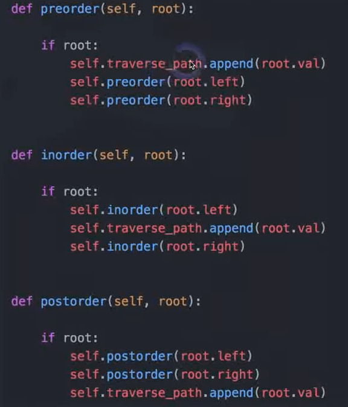
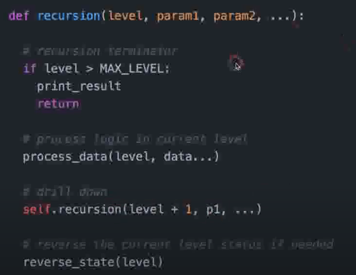
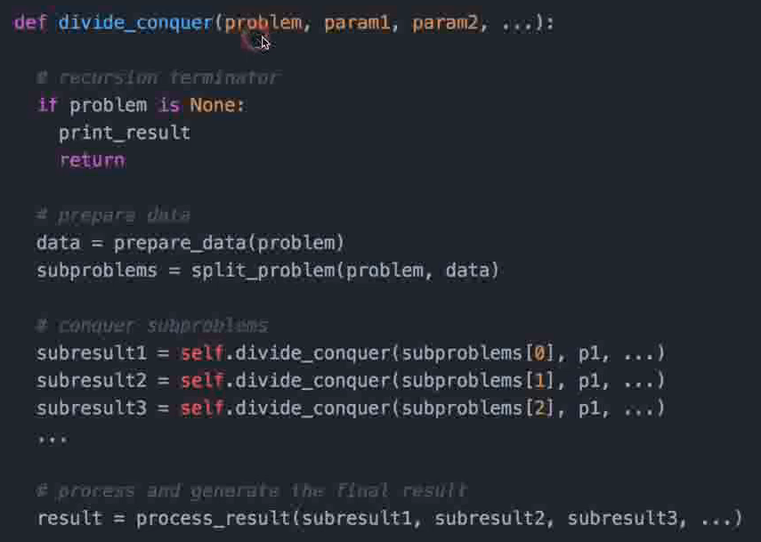

# algorithms

steps:

1. clairification
2. possible sulution
3. code
4. test

Tree Traversal
pre-order:root-left-right
In-order:left-root-right
Post-order:left-right-root

Recursion

Divde & Conquer

